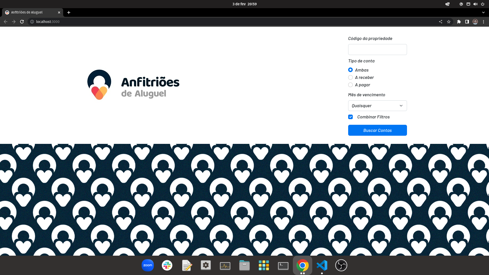
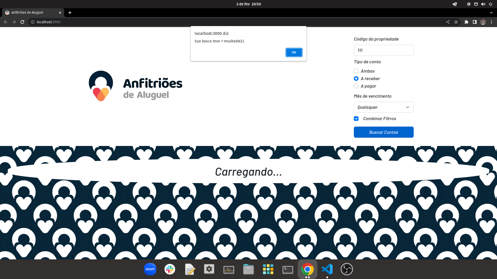
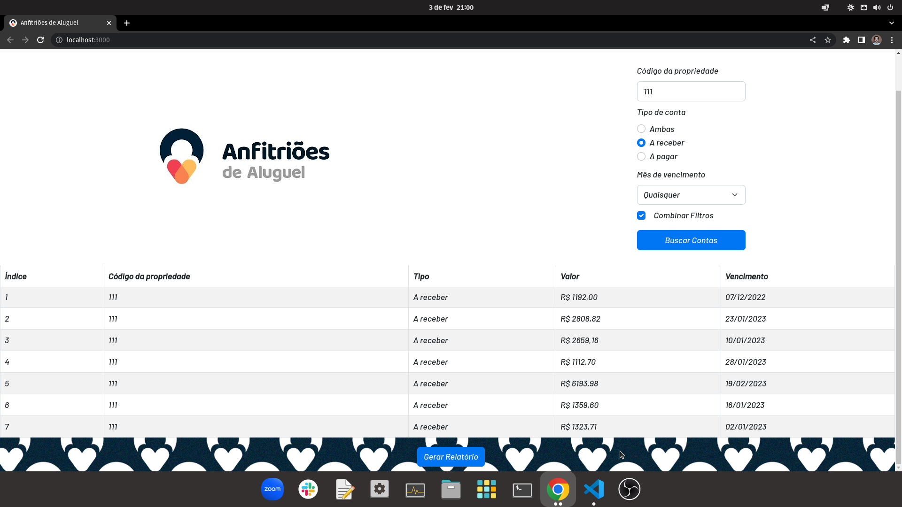
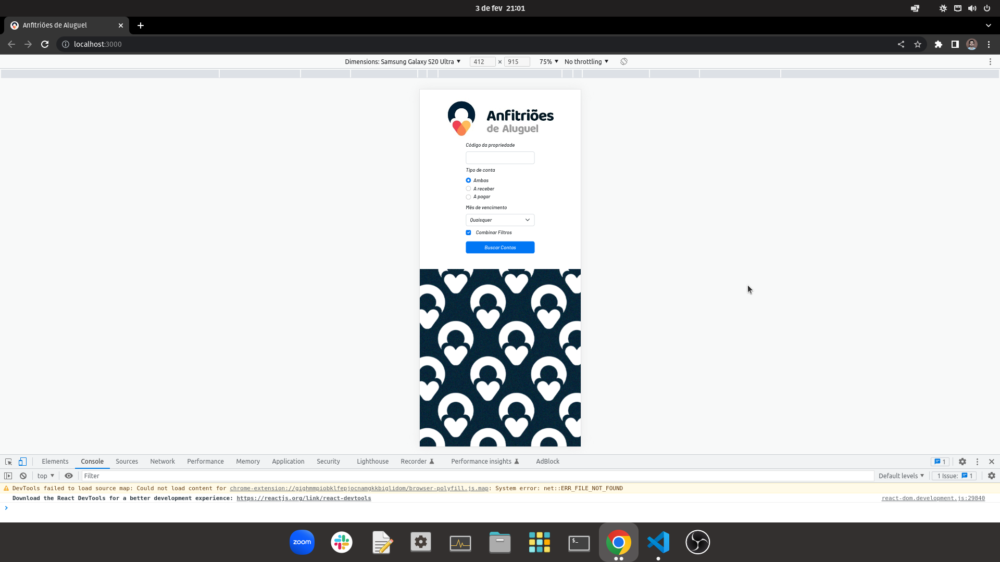
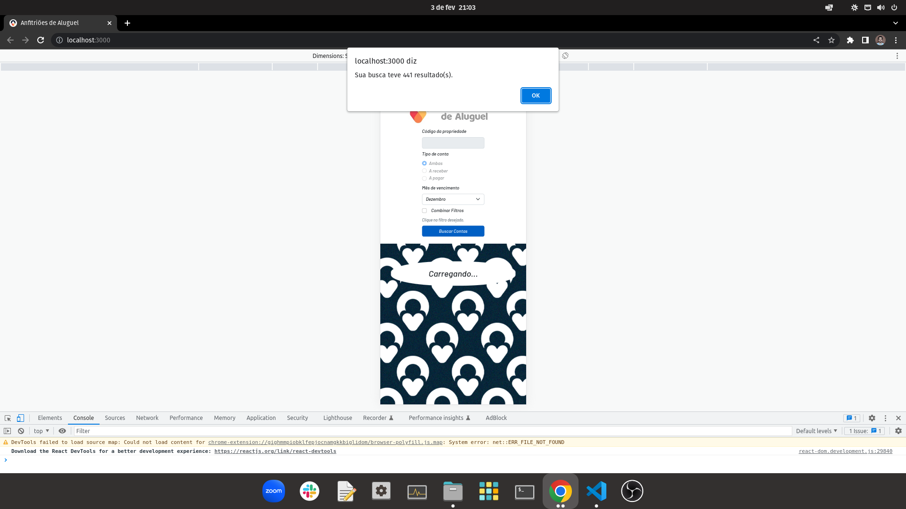
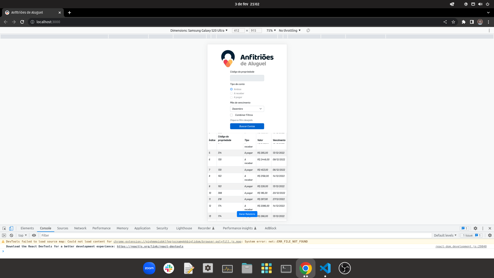

<h1>Desafio Coding AdA</h1>

<h2>Desktop preview</h2>

<div>



</div>

<h2>Mobile preview<h2>

<div>



</div>

<h2>Instalação</h2>

1. Clonar o repositório (ou baixar e descompactar o código fonte) e entrar na pasta ADA
```
git clone git@github.com:talesrodriguesDEV/ADA.git
cd ADA
```

2. Configuração do Backend
- **Renomear o arquivo .env.example para .env**
```
cd backend
npm install
docker-compose up
```

3. Configuração do Frontend
```
cd frontend
npm install
npm start
```

<h2>Relatório</h2>

Este projeto foi desenvolvido com React no frontend e Node no backend, ambas ferramentas baseadas em JavaScript. Fiz essa escolha porque a Anfitriões de Aluguel utiliza JavaScript, bem como HTML e CSS, que são inerentes ao React, e porque são as tecnologias que mais domino, por enquanto.

O backend é uma RESTful API construída com Express e conectada a um banco de dados MongoDB através da Mongoose, uma ODM. Escolhi um banco de dados não relacional, uma vez que o desafio não envolvia relacionamentos, por tratar-se de um único tipo de dados (Contas). Dados esses que obtive convertendo o .csv em .json e depois manipulando os dados com JavaScript, de acordo com as instruções fornecidas. Usei Docker para "rodar" o banco de dados e a API, prezando pela conteinerização da aplicação.

O frontend é uma SPA contruída com design responsivo. Fiz uso de useState e useEffect (React Hooks), fetch API, assincronicidade, renderização condicional, componentização, entre outras funcionalidades do React/JavaScript. A estilização foi feita com Bootstrap, utilizando uma biblioteca própria do React, porque é um framework muito eficiente na elaboração de formulários e tabelas, principalmente.

O usuário pode filtrar as Contas pelos três critérios requisitados de maneira conjunta ou independente, bem como fazer o download de todos os resultados em um arquivo .json. 

<h2>Stacks</h2>

<h3>Frontend</h3>

1. React
2. HTML
3. CSS
4. JavaScript
5. Bootstrap

<h3>Backend</h3>

1. Node
2. Express (RESTful APIs)
3. Mongoose (MongoDB ODM)
4. Docker
5. JavaScript
